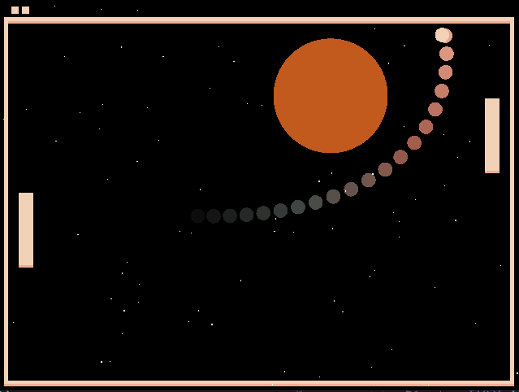

# Space Pong

Author: Hao Chen

Design: Pong in space with gravity and hit stars to earn bonus points for your next score!

Screen Shot:

How To Play:

- Use mouse to control your left paddle to hit the ball back just like what you did in other Pong games.
- There will be stars passing by with gravity attracting the ball. Bigger stars have greater gravity, of course!
- Every time the ball hits a star, 1 more bonus point will be granted for the next score. It can be yours or your opponent's.

This game was built with [NEST](NEST.md).
